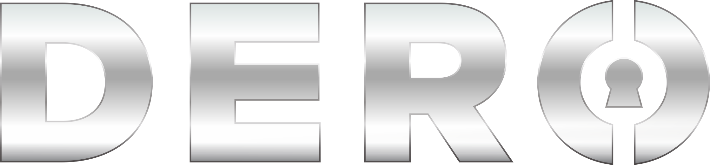

# Welcome to the DERO Wiki

This wiki is an unofficial collection of guides for newcomers to the DERO Project.  
If this is your first time hearing about DERO, we recommend starting with the [DERO website](https://dero.io).

## What is DERO?

DERO is a new blockchain technology combining enhanced privacy with smart contracts and fast transactions, on a stable and secure network.

The goal is to create a unique state of the art blockchain technology with enhanced reliability, privacy, security, usability, and portability by bringing together some of the best proven technologies like *CryptoNote Protocol* and *Smart Contracts*, thereby allowing for the creation of **Private Smart Contracts**.

## Quick Navigation

| **Wallets**  | **Mining** |
|:------------:|:----------:|
  |   |  
[Setting up a New Wallet](Getting-Started#new-wallet)  | [Mining DERO](Getting-Started#mining)  |  
A guide on setting up a DERO wallet | A step-by-step guide to start mining DERO |  

## Have Questions or Need Help?

Check out our [Discord](https://discord.gg/GmDgjkD), our [Slack Channel](https://deroproject.slack.com/join/shared_invite/enQtMzAwMDc5MDY4NDUzLTAzOWNjYWZmNDgxZTk1YjNiNWFiYjg1OWNiMmQ2MmUxOWRmNjNjOWM3ODAzMzE3M2RhNzBhZjUyZGQxYjQxY2U), or our [subreddit](https://reddit.com/r/deroproject) to get in touch.
