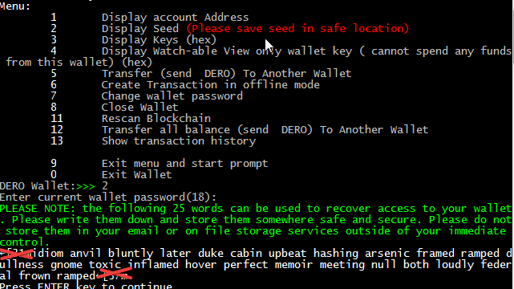

# Setting Up a Paper Wallet

The main purpose of a paper wallet is to quickly create a wallet to start receiving funds. 

**You will not be able to spend or send your funds to other people until you set up a CLI wallet on an internet-connected machine**

## Making a Paper Wallet

### 1. Downloading the Wallet

Binary distributions can be found [here](http://seeds.dero.io/alpha).

Select the appropriate file for the target platform (Windows, Linux, Solaris, OpenBSD, NetBSD, FreeBSD, Darwin, DragonFly).

Windows binaries are provided in the `.zip` format, while the `.tar.gz` format is provided for the rest.

### 2. Installing

Extract the `.zip` or `.tar.gz` file to a directory of your choice

In the running CLI wallet client,

- type `2` to generate a new wallet.
- Enter a filename for the wallet(for example, `dero`)
- Enter a password to encrypt the wallet file with, and confirm it
- Enter the number corresponding to what language you'd like your 25 word mnemonic seed to be in(for most of you, it will be `0` - English)

### 3. Backing up the Wallet

- type `2`
- enter your password
- the 25 word mnemonic seed will appear below the paragraph in green
- remove `←[31m` from the beginning and `←[37m` from the ending
- **safely save and store these words**

**DO NOT SHARE IT WITH ANYONE**. **Anyone who has these can *access your funds* and has *complete control* over your wallet.**

To make it secure, we recommend **formatting the whole disk and re-installing your OS**, if it is a fresh install.

Else, **permanently delete your folder and everything inside it**
