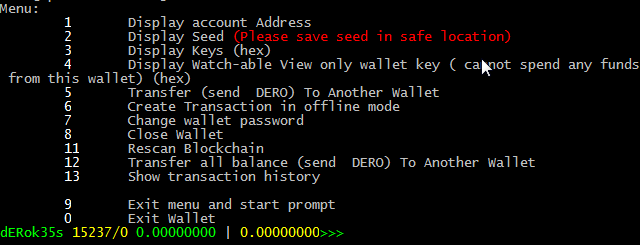
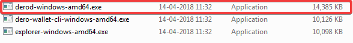
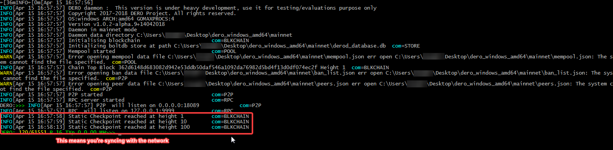
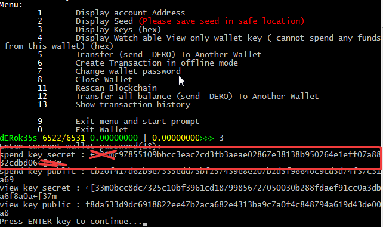
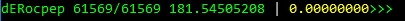
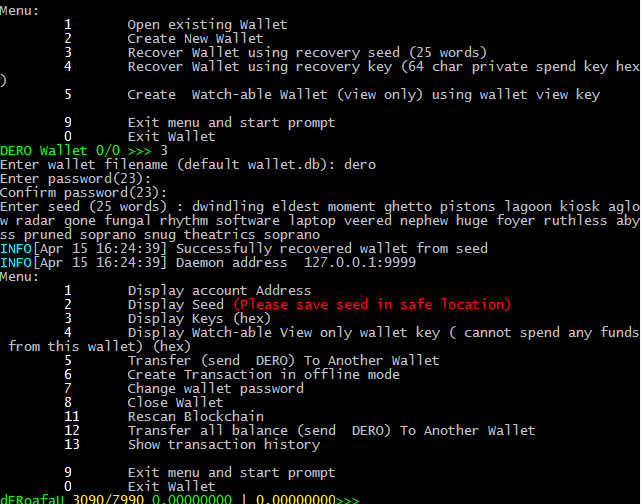
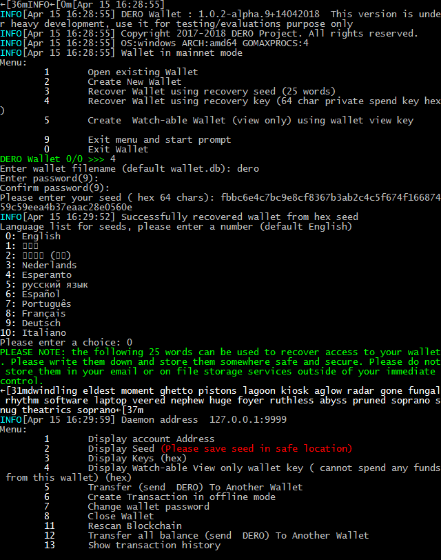

# Using the CLI Wallet

## Screenshots

Here's a quick screenshot of the CLI Wallet in action-



## Downloading

Binary distributions can be found [here](http://seeds.dero.io/alpha).

Select the appropriate file for the target platform (Windows, Linux, Solaris, OpenBSD, NetBSD, FreeBSD, Darwin(MacOS), DragonFly).

Windows binaries are provided in the `.zip` format, while the `.tar.gz` format is provided for the rest. 

## Installing

Extract the `.zip` or `.tar.gz` file to a directory of your choice

## Synchronizing the Blockchain

Run `derod-(operatingsystem)-(architecture).(exe)`. It will now start syncing with the network.

(if your AV or Firewall pops up, tell it to allow/trust the program)





* You can see how much you've synced and how you have to go on the left(here, `1212` is how much I've synced and `61551` is the height of the blockchain. I have to sync 60K+ more blocks)


## Using the CLI Wallet

With `derod-(operatingsystem)-(architecture).(exe)` still running, run `dero-wallet-cli-(operatingsystem)-(architecture).(exe)`

### Creating a Wallet

In the running CLI wallet client,

* type `2` to generate a new wallet.

* Enter a filename for the wallet(for example, `dero`)

* Enter a strong password which you'd like to encrypt your wallet with, and confirm it.

* Enter the number corresponding to what language you'd like your 25 word mnemonic seed to be in(for most of you, it will be `0` - English)

  Your wallet is now created, and should begin checking the blockchain for any transactions.

### Opening a Wallet

In the running CLI wallet client,

* type `1` to open an existing wallet

* Enter the name of the wallet you had set when it was created.

* Enter the password you entered when you created the wallet.

  Your wallet should now open(make sure the daemon is open) and begin checking the blockchain for any transactions.

### Viewing Wallet Address

To view your wallet address after opening wallet, in the running CLI wallet client,

* type `1`
* copy the part in green

### Exporting Keys

Each DERO wallet is, essentially, just a string of 25 words from which the public address is derived.
It is **very** important to export these keys and back them up somewhere that is safe and secure (meaning somewhere reliable/permanent that no one else can access).

In the event of a lost or corrupted wallet file, computer crash, etc., the *25 word mnemonic seed* and *Private Spend Key* are the **only way** to restore a wallet and recover the funds it holds.

**DO NOT SHARE IT WITH ANYONE**. **Anyone who has these can *access your funds* and has *complete control* over your wallet.**

In the running CLI wallet, 

* type `2` 
* enter your password
* the 25 word mnemonic seed will appear below the paragraph in green
* remove `←[31m` from the beginning and `←[37m` from the ending
* **safely save and store these words**


* type `3`

* enter your password

* the private & public spend and view key will appear

* for backing up purposes, 

  * remove `←[31m` from the beginning and `←[37m` from the ending of the seemingly random string of letters and numbers in front of `spend key secret`
  * **safely save and store this string**

  


### Viewing Wallet Balance

Upon opening your wallet, your balance will be located at the bottom.

Green means unlocked, and yellow means locked.



### Sending DERO Transactions

In the running CLI wallet client,

* type `5`


* enter your password

* enter the address you want to send it to

* enter the amount you want to send

* Type `y/n` if you want to provide a payment ID. This is required when you're depositing DERO to an exchange

  * Type `y` if you want to provide it
  * Enter the provided payment ID

  ​

  Note that usually the service will generate and provide the payment ID

  If it's not provided, it is most likely not needed.

* press enter

  Your transaction should now be on the way to the recipient's wallet!

### Exiting the Wallet

'Live' wallets loaded into the CLI wallet client must be synced with the blockchain in order to properly calculate balance, view transaction history, etc. 

It is important to properly save the wallet data before exiting it so that the synchronized data is not lost.

To save a wallet's data and exit, in the running CLI wallet client, with an open wallet, 

* type `0` and press enter

## Restoring your Wallet

### 25 Word Mnemonic Seed

In the running *dero-wallet-cli* client,

* type `3`

* Set a name for your new wallet(for example, `dero`)

* Enter a strong password which you'd like to encrypt your wallet with, and confirm it.

* Enter your 25 word seed



* It should return with a message similar to `Successfully recovered wallet from seed`

* In case you haven't already, open `derod` so that the wallet can sync with the network.

Congratulations! You've successfully recovered your wallet with your 25 word seed.


### Private Spend Key

In the running *dero-wallet-cli* client,

* type `4`

* Set a name for your new wallet(for example, `dero`)

* Enter a strong password which you'd like to encrypt your wallet with, and confirm it.

* Enter your Private Spend Key



* It should return with a message similar to `Successfully recovered wallet from hex seed`

* It will ask you what language you'd like to view your 25 word seed in. Enter the number corresponding to your language(if you're reading this, it will most likely be `0`) and back them up

* In case you haven't already, open `derod` so that the wallet can sync with the network.

Congratulations! You've successfully recovered your wallet with your private spend key!

## Help

You can always type `help` to see a list of commands.

```
commands:
        help            this help
        address         Display user address
        balance         Display user balance
        get_tx_key      Display tx secret key for specific transaction
        integrated_address      Display random integrated address (with encrypte
d payment ID)
        menu            Enable menu mode
        rescan_bc       Rescan blockchain again from 0 height
        password        Change wallet password
        payment_id      Print random Payment ID (for encrypted version see integ
rated_address)
        seed            Display seed
        show_transfers  Show all transactions to/from current wallet
        payments        Show all transactions  with given payment ID
        set             Set/get various settings
        status          Show general information and balance
        spendkey        View secret key
        transfer        Transfer/Send DERO to another address
                        Eg. transfer <address> <amount> [ <address2> <amount2> ]
... [<payment_id>]
        transfer_all    Transfer everything to another address
        viewkey         View view key
        walletviewkey   Wallet view key, used to create watchable view only wall
et
        version         Show version
        bye             Quit wallet
        exit            Quit wallet
        quit            Quit wallet
```


​    

